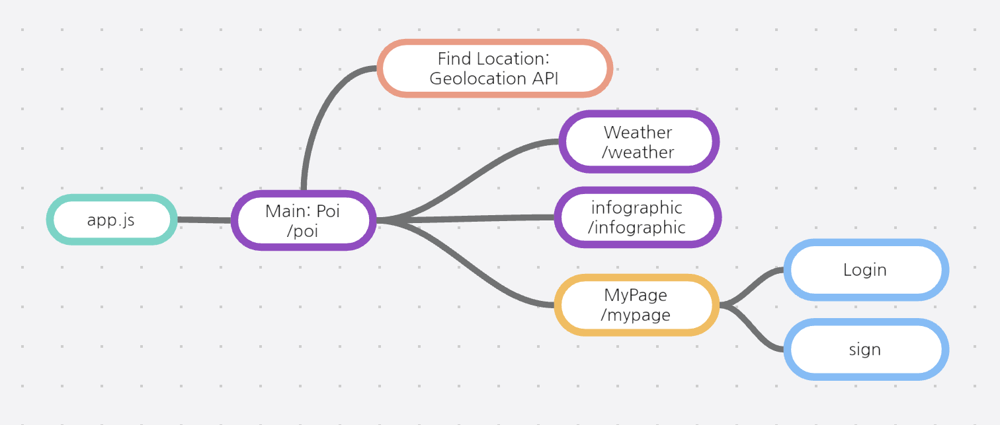
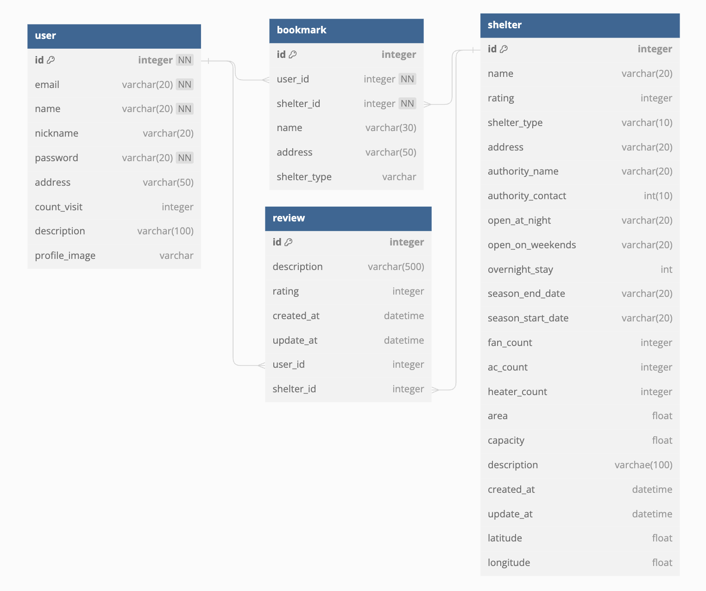

# 무한쉼터 (Weather Haven) 🏘️
코딩 부트캠프에서 진행했던 팀 프로젝트 작품입니다.
- 2023년 8월 14일부터 2023년 9월 2일까지 약 3주간 진행했습니다.
- 데이터 가공 및 분석을 활용한 풀스택 웹앱 제작을 실습했습니다.
- 부트캠프에서 자체적으로 호스팅하는 사설 GitLab 인스턴스에 있던 repo의 최종 브랜치를 클론했습니다.
    - 이후 리팩토링/기능추가/버그픽스는 개인적으로 진행하고 있습니다.

## 팀 구성
프론트엔드 개발 팀원 3명, 백엔드 개발 팀원 4명으로 구성된 팀입니다.

## 역할 및 담당
팀장 역할을 맡아 서비스 기획을 전담하고, 프론트엔드 개발을 주도했으며, 백엔드 개발과 데이터 가공 및 분석에 협업했습니다.
- 서비스 기획 (기여도 100%)
    - 서비스 기획안 작성
    - 주요 기능 정의
    - 유저 페르소나 및 스토리 작성
    - 마켓 및 데이터셋 리서치
    - UI/UX
        - 레이아웃 프로토타이핑
        - Figma로 와이어프레임 제작
- 프론트엔드 개발 (기여도 90%)
    - React
        - 전체적인 페이지, 라우팅, 컴포넌트 구조 설계
        - props drilling을 사용해 하위 컴포넌트로의 상태 전달 구현
        - state handler 함수를 사용해 상위 컴포넌트로의 상태 전달 구현
        - Context API를 활용한 cross-component 상태 관리 구현
        - useReducer hook과 dispatcher를 사용해 사용자 정보 및 로그인 상태를 전역 상태 관리 구현
        - Axios 기반으로 HTTP API 통신 구현
    - Tailwind CSS 
        - CSS Flexbox & Grid 기반으로 전체적인 레이아웃 구현
- 백엔드 개발 (기여도 10%)
    - 프론트엔드와의 REST API 연동 작업
    - 프론트엔드와의 에러 핸들링 연동 작업
- 데이터 분석 (기여도 50%)
    - 데이터셋 리서치
    - Pandas 라이브러리를 사용해 2013년~2023년 폭염/한파 경보 및 주의보 데이터셋을 기반으로 한여름/한겨울 극한날씨 발생 추이 분석
        - 선형회귀 분석을 통한 폭염 및 한파 예측 시스템을 구현하기 위해 수행했으나 기능으로 도입되지는 않았습니다.

# 프로덕트 기획

## 프로덕트 설명
"극한날씨 멈춰! 가까운 쉼터에서 건강하게 휴식하세요!”
- 갈수록 극단적으로 변하는 한여름 한겨울 날씨, 폭염과 한파로부터 대피할 수 있는 공공장소인 '무더위 쉼터'와 '한파 쉼터'를 위치기반으로 손쉽게 찾고 방문해서 건강을 지키세요. 쉼터에 관한 정보 뿐만 아니라 기후변화와 관련된 다양한 정보들도 함께 제공해드리는 생활밀착형 웹앱입니다.
- 서울특별시 지역을 대상으로 시범 제작했습니다.

## 기획 의도
- 기후변화는 이제 먼 미래의 일이 아니라 일상이 되어버렸습니다. 한여름 폭염과 한겨울 한파같은 극단적인 기후의 빈도와 주기가 점점 증가하고 있습니다. 
- 정부와 지방자치단체에서는 시민 누구나 방문해 이러한 '극한날씨'로부터 대피하고 안전하게 휴식할 수 있는 공공장소들을 '무더위 쉼터'와 '한파 쉼터'로 지정해 운영하고 있습니다.
- 하지만 이러한 극한날씨 쉼터들이 우리 주위에 어디 있고 어떻게 마련되어 있고 어떻게 찾아갈 수 있는지를 쉽고 편하게 알 수 있는 방법이 지금은 없습니다.
- 그래서 주요 생활 반경 및 현재 위치 인근에 마련되어 있는 ‘극한날씨 쉼터’의 위치와 상세정보를 모든 시민들이 지도상에서 손쉽게 파악해서 이용할 수 있도록 해주고, 기후변화라는 현실을 개인 및 가구 차원에서도 대처할 수 있도록 각종 관련 데이터들을 시각화해서 직관적으로 정보전달을 해주는 서비스를 기획하게 되었습니다.
    - 정부 및 지자체에서 제공하는 극한날씨 쉼터에 대한 접근성을 높여 시민들의 건강관리에 도움을 주자!
    - 냉난방 기구가 마련되어있는 공공장소인 극한날씨 쉼터의 이용을 장려해서, 개별가구의 냉난방기구 사용량을 낮춰 전력소비량 경감에 기여하자!
    - 극한날씨의 위험성에 관련된 시각화된 데이터를 보여줘서 시민들이 미리 대비하고 건강관리를 할 수 있도록 도와주자!
        - 기후변화에 대한 시민들의 인식도 함께 향상시키자!
    - 극한날씨 쉼터의 접근성과 현황에 관련된 데이터도 함께 보여줘서 지방자치 개선과 시민참여에도 활용할 수 있도록 하자!

## 주요 기능
- 극한날씨 쉼터 지도 기능
    - 정부 및 지자체에서 지정하고 관리하는 극한날씨 쉼터의 위치를 지도상에 마커로 표시해줍니다.
    - 사용자가 선택한 세부 행정구역에 있는 쉼터들의 목록을 표시해줍니다.
    - 장소명, 주소, 담당기관, 연락처, 냉난방기구 현황 등 각 쉼터의 상세 정보를 표시해줍니다.
    - 사용자는 쉼터를 방문하고 나서 방문 후기를 작성할 수 있고, 다른 사용자들이 남긴 후기도 확인할 수 있습니다.
- 기상정보 대시보드 기능
    - 사용자가 선택한 지역의 온도, 습도, 풍속 등 현재의 기상 정보뿐만 아니라 단기 기상 예보를 위젯 형식으로 직관적으로 표시합니다.
    - 만약 현재 기상 상태가 '극한날씨'에 해당되거나 근접한 경우 위젯의 색깔을 바꾸고 경고 메세지를 표시해 알려줍니다.
- 인포그래픽 대시보드 기능
    - 다음과 같은 각종 통계 데이터를 그래프로 시각화해서 보여줍니다.
        - 극한날씨 쉼터와 관련된 데이터
            - 예: 서울시에 있는 각 구마다 보유한 쉼터 개수
        - 극한날씨에 따른 건강관리 관련 데이터
            - 예: 폭염 시즌 온열질환 환자 발생 추이
        - 기후변화 관련 통계 데이터
            - 예: 지난 10년간 폭염 및 한파 발생 
        - 한여름/한겨울 에너지 사용량 관련 데이터
            - 예: 여름철 정전 사고 발생 통계
- 마이페이지 기능
    - 사용자가 계정을 만들고 프로필을 관리할 수 있습니다.
    - 사용자가 작성한 쉼터 후기 목록을 열람할 수 있습니다.

## 유저 시나리오
- Who: 출장과 야외 활동이 많고 건강에도 관심이 많은 건설사 현장관리직 43세 강현성님
- What: 주요 활동 지역에 있는 쉼터의 위치를 쉽게 파악하고 방문하고자 함
- When: 폭염과 한파와 같은 극단적인 날씨로부터 안전한 휴식이 필요한 언제나
- Where: 극단적인 날씨로부터 직접적인 영향을 받는 야외 활동 및 이동중에
- Why:
    - 우리 동네 극한날씨 쉼터가 어디에 얼마나 있는지 알아보기 위해
    - 접근성이 좋은 극한날씨 쉼터를 방문해 건강을 지키고 휴식을 가지기 위해
    - 극단적인 기후가 왜 발생하는지 기후변화 관련 정보를 알아보기 위해
    - 극단적인 기후가 발생할 가능성이 높은 시기를 알고 미리 대비하기 위해

# 프로덕트 개발

## 기술 스택
- 프론트엔드
    - HTML5 + CSS + JavaScript
    - React
        - axios
            - API 통신 구현
        - React Leaflet
            - 지도상에 현재 위치 및 POI 마커 정보 표시
        - react-chartjs-2
            - JSON 형식의 정적 데이터를 차트로 시각화
    - Tailwind CSS
    
- 백엔드 
    - Node.js + Express
    - MongoDB
        - Mongoose ODM
- 데이터 가공 및 분석
    - Python
    - MySQL
- 배포 
    - VMWare
    - Nginx
    - PM2
- 기타 dependency
    - npm
    - yarn
    - babel
    - axios
    - jsonwebtokens
    - dotenv
    - multer
    - bcrypt
    - codesandbox

## 프로젝트 구조

### 프론트엔드



> React 기반으로 기능별 page로 구성
    - Poi: 무더위 쉼터와 한파 쉼터의 위치 및 시설 정보를 관심지점(point-of-interest)으로써 
    - Weather: OpenWeatherMap API를 통해 행정구역의 현재 날씨, 기온, 습도 등
    - Infographic : 지역별 쉼터의 필요성을 폭염, 기후 등으로 데이터로 나타난 인포그래픽 페이지.
    - MyPage : 회원이 작성한 쉼터 리뷰와 리뷰 작성 개수별 등급을 확인할 수 있는 페이지.

### 백엔드


- 웹 서비스 계층 구조
    - Config : 환경변수 설정
    - Model : DB와 연동하여 사용자가 입력한 데이터나 사용자에게 출력할 데이터 질의
    - Service : 요청받은 정보를 알맞게 가공하는 로직 수행
    - Controller : 서비스로 요청 전달 및 응답
    - Middleware : JWT 토큰을 이용한 회원 인증, 에러처리 및 이미지변환

### 데이터베이스 ERD



### 데이터 가공 및 분석 과정
- 무더위/한파 쉼터 위치 및 시설 정보
    1. [서울 열린데이터광장](https://data.seoul.go.kr/)에서 서울시 무더위 및 한파 쉼터 위치정보와 시설정보 취득
        - [서울시 무더위쉼터](http://data.seoul.go.kr/dataList/OA-21065/S/1/datasetView.do)
        - [서울시 한파쉼터](http://data.seoul.go.kr/dataList/OA-21066/S/1/datasetView.do)
    2. 무더위 쉼터와 한파 쉼터를 하나의 데이터 테이블로 통합
        - 무더위 쉼터와 한파 쉼터의 위치 정보 데이터의 형식이 경위도 좌표계와 XY좌표계로 형식이 다름
        - 하나의 데이터 테이블로 합치기 위해 한파 쉼터의 XY좌표계 값을 경위도 좌표계 값으로 변환하는 작업이 필요
        - 한파 쉼터의 GRS-80 XY좌표계 값을 경위도 좌표계 값으로 변환해주는 Geocode 확장 기능을 사용
    3. 서울시 구별로 인구/면적 대비 쉼터의 수용인원/면적을 분석해 인포그래픽에 활용
- 무더위/한파 쉼터 냉난방기구 효율 수치화
    1. 데이터의 컬럼 및 데이터에 대한 정보 파악
        - 각 쉼터의 도로명 주소를 이용해 각 구에 배치되어 있는 쉼터 수를 파악하고자 함
        - 선풍기 보유 대수, 에어컨 보유 대수, 면적 3가지 정보를 이용해서 냉방효율을 계산하고자 함
    2. 각 쉼터의 도로명 주소를 이용해 각 구에 배치되어 있는 쉼터 수를 파악
        - 도로명 주소에서 ‘구’ 단위는 항상 ‘구’라는 char를 가지고 있어서, 해당 column의 values를 space를 기준으로 분리 후 ‘구’로 위치 정보를 단순화
            - 서울특별시에 해당하는 구만 해당이 되기 때문에 가능하다고 판단
        - values_count()함수를 이용해서 특정 ‘구’가 해당 column에서 몇 번 언급되었지를 파악
    3. 선풍기 보유 대수, 에어컨 보유대수, 면적 3가지 정보를 이용해서 냉방효율을 계산
        - 선풍기보다 에어컨이 냉방 효율이 높기 때문에 하나의 에어컨이 선풍기에 대해 대략적으로 얼마나 효율적인지에 대한 선행 조사
        - 선풍기와 에어컨의 성능을 평가하는 척도가 다르기 때문에 임의로 어느 정도 가중치를 선택하는 것으로 처리를 하는 것을 선택
            - 다만 무리하게 가중치를 주면 안되므로 관련 정보를 조사, 에어컨의 냉방 효율이 선풍기보다 약 10배 높으므로 가중치를 10으로 적용
    4. 데이터를 처리해 쉼터 시설정보에 추가 컬럼으로 취합
        <details>
            <summary>코드</summary>
            ```

            import pandas as pd
            import matplotlib.pyplot as plt
            import matplotlib.font_manager as fm

            # Specify the correct file path
            file_path = 'C:/Users/bewis/Downloads/seoulhotweathershelter.csv'

            # Read the CSV file using the 'cp949' encoding for translating all the codes
            df = pd.read_csv(file_path, encoding='cp949')

            # Replace 'AddressColumn' with the actual name of the column containing the addresses
            address_column_name = '도로명주소'

            # Extract district (gu) names from addresses
            # Split
            def extract_district(address):
                parts = address.split(' ')
                for part in parts:
                    if '구' in part:
                        return part
                return None

            # Apply the extract_district function to the address column
            df['District'] = df[address_column_name].apply(extract_district)
            print(df['District'])
            # Count the occurrences of each district
            district_counts = df['District'].value_counts()

            print(district_counts)
            print(district_counts.index)

            # Set the font for handling Korean characters
            font_path = "C:/Users/bewis/Downloads/maplestory-otf-light/Maplestory OTF Light/Maplestory OTF Light.otf"
            fontprop = fm.FontProperties(fname=font_path)

            # Plotting the histogram
            plt.figure(figsize=(10, 6))
            plt.hist(district_counts.index, weights=district_counts.values, bins=len(district_counts.index), color='blue', align='mid', width=0.6)  # Adjust width
            plt.xlabel('District', fontproperties=fontprop)  # Set font properties for x-axis label
            plt.ylabel('Frequency')
            plt.title('Frequency of Districts', fontproperties=fontprop)  # Set font properties for title

            # Set x-axis tick positions and labels with Korean text
            plt.xticks(rotation=0, fontproperties=fontprop)  # Set font properties for x-axis tick labels
            plt.xticks(ticks=range(len(district_counts.index)), labels=district_counts.index, fontproperties=fontprop)

            # Adjust layout for better visibility
            plt.tight_layout()

            # Show the plot
            plt.show()

            #calculating cooling efficiency in shelter
            df['냉방효율']=df['선풍기보유대수']+10*df['에어컨보유대수']/df['면적']

            print(df['냉방효율'])
            ```
        </details>
- 지난 10년간 극한날씨 발생 추세 분석
    1. [기상청 기상자료개방포털](https://data.kma.go.kr/cmmn/main.do)에서 2013년~2023년 서울 관측소에서 매일 기록된 온도, 습도, 풍량, 체감온도 데이터 취득
        - [종관기상관측(ASOS)](https://data.kma.go.kr/data/grnd/selectAsosRltmList.do?pgmNo=36)
        - [체감온도](https://data.kma.go.kr/climate/windChill/selectWindChillChart.do?pgmNo=111)
    2. 취득한 CSV 데이터셋들을 Pandas DataFrame으로 변환 및 취합
    3. 일자별 한여름 체감온도와 한겨울 최저기온 측정값을 기준으로 그 날이 '극한날씨'였는지 여부를 각 row별로 계산
        - 폭염특보와 한파특보는 기상청에서 당시의 기상 상황에 기반해 자체적인 분석과 예측으로 '사전 경고' 차원에서 발령을 하게 됨
        - 여기서는 이미 과거의 데이터를 기반으로 폭염과 한파 추세를 '사후 판단'하고자 하므로, 기상특보 발령 여부를 사용할 필요가 없음
        - [기상청 기상특보 발령 기준](https://www.weather.go.kr/w/weather/warning/standard.do)을 감안해 '극한날씨'의 기준을 자체적으로 정의
            - 2023년 5월 이전까지 사용된 기상청 폭염특보 발표 기준 (5월~9월)
                - 폭염주의보: 일 체감온도 최고 33℃ 이상인 상태가 2일 이상 지속될 것으로 예상될 때
                - 폭염경보: 일 최고 체감온도 35℃ 이상인 상태가 2일 이상 지속될 것으로 예상될 때
                - 2023년 5월 이후부터 사용되는 기상청 폭염특보 발효 기준은 기존의 조건에서 정성적 지표(중대한 피해 여부를 감안)가 추가되었으므로 여기서는 정량적 분석을 위해 기존의 기준을 사용하도록 함
            - 기상청 한파특보 발표 기준 (10월~4월)
                - 한파주의보: 아침최저기온이 전날보다 10℃ 이상 하강하여 3℃ 이하이고 평년값보다 3℃가 낮을 것으로 예상되거나 아침최저기온이 -12℃ 이하가 2일 이상 지속될 것이 예상될 때
                - 한파경보: 아침최저기온이 전날보다 15℃ 이상 하강하여 3℃ 이하이고 평년값보다 3℃가 낮을 것으로 예상되거나 아침최저기온이 -15℃ 이하가 2일 이상 지속될 것이 예상될 때
    4. 해당 날짜가 극한날씨에 해당하는지 여부를 boolean 값으로써 새로운 컬럼으로 추가